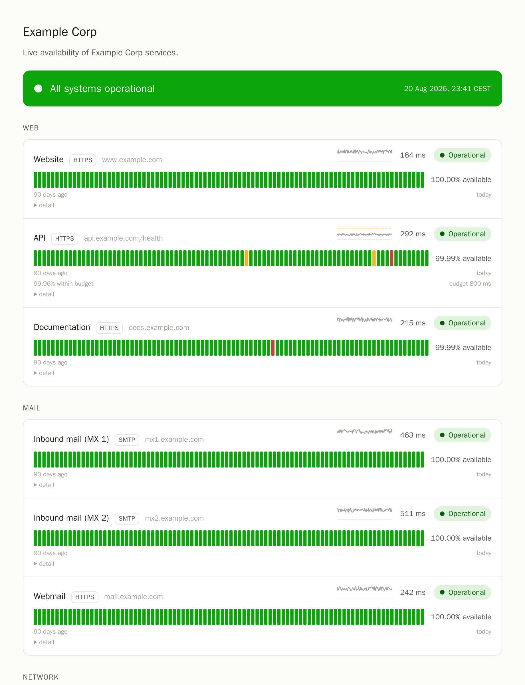

# serverless-status

A status page on your own domain that costs nothing to run and needs no
server: Grafana Cloud's probe network does the monitoring — including real
ICMP ping and a full SMTP STARTTLS conversation — and an AWS Lambda renders
a static page every minute behind CloudFront, with history you own in
DynamoDB. One `tofu apply` spans both control planes.



## Why this exists

Every free status page makes you choose: HTTP-only checks (GitHub-Actions
based pages can't do ping or port 25), an always-on server to self-host, or
a vendor who owns your history and your subdomain. This project refuses the
choice. The page:

- serves a real certificate on your hostname, via CloudFront + ACM;
- covers `https`, `http`, `ping`, and `smtp` checks — the SMTP check runs
  the actual STARTTLS dialogue, so a mail server that accepts connections
  but fails TLS negotiation shows as down;
- owns its uptime bars, incident log, and `status.json` independently of
  any vendor's retention;
- renders from cached state and says so when monitoring itself is down —
  never a 500, never stale green presented as current;
- depends on nothing external to display: inline CSS and SVG, system fonts,
  no CDN, no analytics. Enforced by tests.

Free-tier arithmetic: Grafana Cloud Synthetic Monitoring (100k executions /
month, budget-checked at plan time) and the Lambda + DynamoDB + CloudFront
always-free tiers. The only optional cost is ~$1/month if you upgrade state
encryption to KMS.

## Getting started

```sh
git clone --branch <latest release> https://github.com/lexbrugman/serverless-status
cd serverless-status
scripts/new-instance.sh ../my-status-page
```

Then follow [docs/setup-guide.md](docs/setup-guide.md). Configuration
reference: [docs/configuration.md](docs/configuration.md). How and why it
works: [docs/architecture.md](docs/architecture.md).

## Development

Everything runs in the toolbox container — the host needs only git and a
container runtime (podman or docker):

```sh
scripts/bootstrap-shell.sh                         # a shell with every pinned tool
scripts/bootstrap-shell.sh scripts/lint.sh         # everything CI lints, identically
scripts/bootstrap-shell.sh scripts/test.sh         # pytest (100% line+branch) + tofu test
scripts/bootstrap-shell.sh scripts/preview.py      # render all fixture states, no credentials
BOOTSTRAP_PUBLISH=8000 scripts/bootstrap-shell.sh scripts/preview.py --serve   # …and browse them
scripts/dev-stack.sh                               # the handler under the real Lambda runtime image
```

Working agreements live in [AGENTS.md](AGENTS.md). Master is release: every
green push tags a CalVer release automatically.
